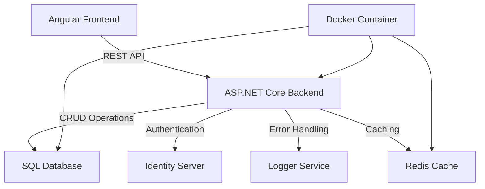
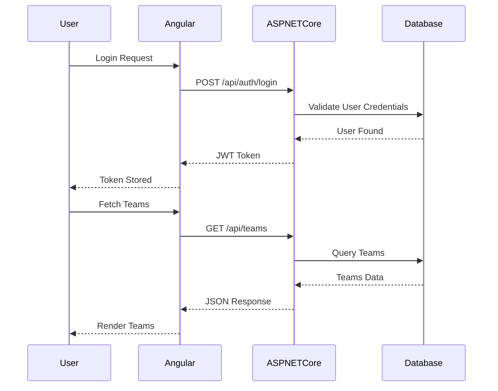

# TeamHub Full-Stack Application Documentation 

TeamHub is a full-stack web application built with Angular and ASP.NET Core Web API. It provides a collaborative platform with a Dockerized deployment workflow. The project leverages C# for backend logic and Angular for responsive UI design, suitable for enterprise-level team management systems.

## Overview

TeamHub aims to deliver a robust, scalable solution for team collaboration, integrating a modern frontend framework (Angular) with a high-performance backend (ASP.NET Core). The application supports containerized deployments using Docker for portability and consistency. Key goals include: 
- Providing seamless communication between frontend and backend layers
- Leveraging REST principles for a stateless, scalable API design
- Ensuring maintainability through modular architecture 
The technology stack was chosen to optimize developer productivity and runtime efficiency. Angular facilitates responsive and interactive UI development, while ASP.NET Core ensures reliable backend processing with native support for dependency injection and middleware-based request handling.

## System Architecture

The architecture follows a layered approach, separating concerns between the frontend, backend, and database. The frontend consumes RESTful APIs exposed by the backend, which in turn interacts with the database for persistent storage. Docker containers orchestrate the deployment of the application.

## Frontend

The frontend layer is built with Angular, focusing on dynamic, component-based UI development. Key technologies and components: 
- Angular CLI for scaffolding and project management
- TypeScript for strong typing and maintainability
- RxJS for reactive programming and state management
- Angular Router for SPA navigation

The component hierarchy includes:
- AppComponent: Root component responsible for initializing the application
- DashboardComponent: Displays team metrics and user activities
- AuthComponent: Handles login and registration workflows

Advantages of Angular include modular development, dependency injection, and robust tooling. Angular Material is utilized for UI consistency and responsive design.

## Backend API

The backend is built with ASP.NET Core, employing a clean architecture pattern. Key features include:
- Controllers: Expose endpoints adhering to REST conventions
- Services: Business logic encapsulation
- Repositories: Abstract database access

API Endpoints:
- POST /api/auth/login: Authenticates user credentials
  Request: `{ "username": "string", "password": "string" }`
  Response: `{ "token": "JWT" }`
  Error Codes: 401 Unauthorized, 400 Bad Request

- GET /api/teams: Retrieves all teams
  Response: `[ { "id": "int", "name": "string" } ]`
  Error Codes: 404 Not Found

- PUT /api/teams/{id}: Updates team details
  Request: `{ "name": "string" }`
  Response: `{ "id": "int", "name": "string" }`
  Error Codes: 400 Bad Request, 404 Not Found

Middleware handles authentication, validation, and error responses. Dependency injection is leveraged for service instantiation.

## Data Flow

The data flow demonstrates interactions between frontend, backend, and database, emphasizing request validation and error handling paths.

## Getting Started

Follow these steps to set up and run the application locally:
1. Clone the repository: `git clone https://github.com/Ahtat204/TeamHub.git`
2. Install Angular CLI: `npm install -g @angular/cli`
3. Navigate to the frontend directory: `cd TeamHub/frontend`
4. Install dependencies: `npm install`
5. Build the frontend: `ng build --prod`
6. Navigate to the backend directory: `cd ../backend`
7. Restore NuGet packages: `dotnet restore`
8. Build the backend: `dotnet build`
9. Set up the SQL database:
   - Configure connection string in `appsettings.json`
   - Apply migrations: `dotnet ef database update`
10. Run the backend: `dotnet run`
11. Set up Docker:
    - Build image: `docker build -t teamhub .`
    - Run container: `docker run -p 8080:8080 teamhub`
12. Access the application at `http://localhost:8080`

Troubleshooting Tips:
- Verify Node.js and npm versions for Angular compatibility.
- Ensure Docker daemon is running before executing container commands.
- Check database connection string for typos or incorrect credentials.
