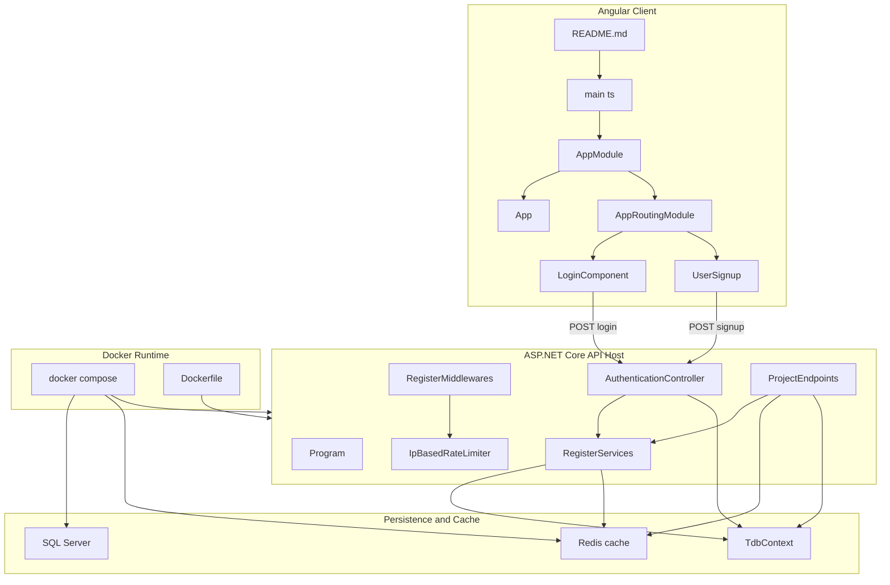
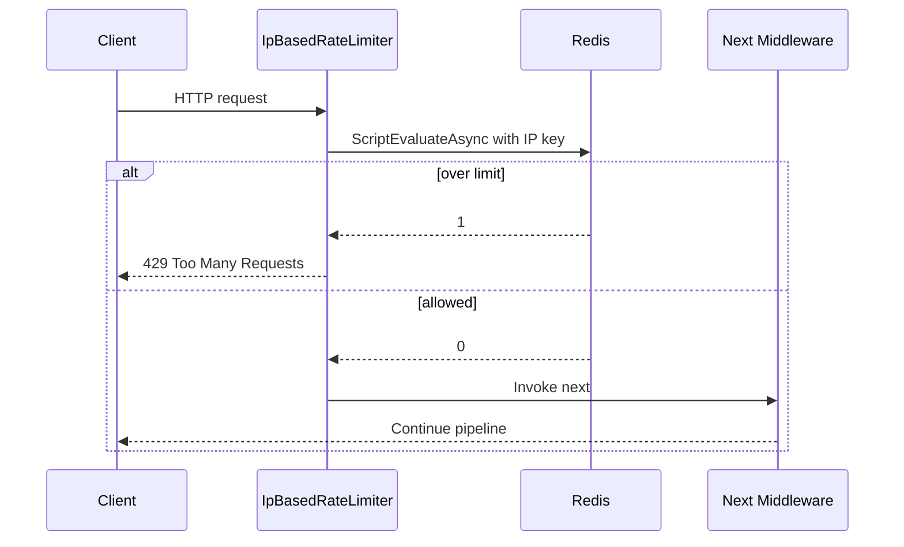
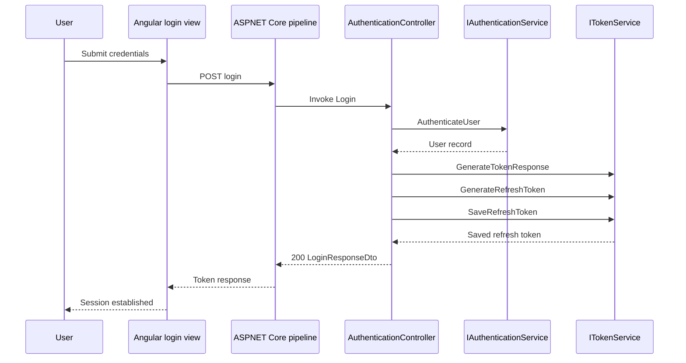
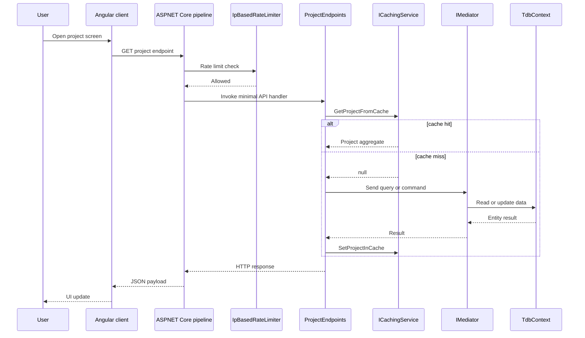

# End-to-end architecture, runtime boundaries, and request flow

# System Architecture and Application Composition

## Overview

TeamHub is composed as a split Angular client and ASP.NET Core Web API backend. The browser-side application starts from , boots `AppModule`, and routes users into login and registration screens. The backend starts from , loads configuration from environment sources, registers application services, then builds the middleware pipeline that protects and executes both minimal API project routes and controller-based authentication routes.

The runtime boundary is layered around three main concerns: presentation in Angular, HTTP/API orchestration in ASP.NET Core, and persistence plus caching through EF Core and Redis. Project workflows are implemented as MediatR CQRS handlers behind minimal API endpoints, while authentication is handled through `AuthenticationController` with JWT access tokens and refresh-token persistence. Docker assets define the production shape of the system as three cooperating containers: API, SQL Server, and Redis.

## Architecture Overview



## Frontend Bootstrap and Route Composition

### 

*teamcollaborationhub.client/README.md*

This file is the Angular developer entry guide for the client runtime. It documents the standard local workflow used by the frontend entry point in .

| Command | Purpose |
| --- | --- |
| `ng serve` | Starts the development server on `http://localhost:4200/` |
| `ng build` | Produces the production build in `dist/` |
| `ng test` | Runs unit tests with Karma |
| `ng e2e` | Runs end-to-end testing through Angular CLI |


### 

*teamcollaborationhub.client/src/main.ts*

This file is the Angular browser entry point. It imports `AppModule` and bootstraps it with `platformBrowser()`, which is the client-side start line for every user session.

| Property | Type | Description |
| --- | --- | --- |
| `AppModule` | `AppModule` | Root Angular module bootstrapped by the browser platform |


| Method | Description |
| --- | --- |
| `bootstrapModule` | Starts the Angular runtime with `AppModule` and enables `ngZoneEventCoalescing` |


### 

*teamcollaborationhub.client/src/app/app-module.ts*

`AppModule` composes the Angular client shell. It declares the root app component and the signup component, imports the routing and Material dependencies, and bootstraps `App`.

| Property | Type | Description |
| --- | --- | --- |
| `declarations` | `App, UserSignup` | Declares the non-standalone components managed by this module |
| `imports` | `BrowserModule, AppRoutingModule, FormsModule, MatButton, MatCard, MatCardContent, MatCardHeader, MatFormField, MatIcon, MatInput, MatSuffix` | Supplies browser, routing, forms, and Angular Material support |
| `providers` | `provideBrowserGlobalErrorListeners()` | Registers browser-level error listeners |
| `bootstrap` | `App` | Root component bootstrapped at application start |


### 

*teamcollaborationhub.client/src/app/app-routing-module.ts*

This module defines the UI routes for the Angular shell. `LoginComponent` is routed directly as a standalone component, while `UserSignup` is routed through the module-declared component path.

| Path | Component | Behavior |
| --- | --- | --- |
| `''` | `''` | Self-redirect entry for the empty path |
| `login` | `LoginComponent` | Renders the login screen |
| `register` | `UserSignup` | Renders the registration screen |


### 

The root route { path: '', redirectTo:"", pathMatch:"full" } redirects the empty path to the empty path. That makes the redirect self-referential instead of pointing to a distinct landing route.

*teamcollaborationhub.client/src/app/app.ts*

The root shell component holds the application title as reactive signal state. Its template is the route outlet host used by the router.

| Property | Type | Description |
| --- | --- | --- |
| `title` | `Signal<string>` | Root title signal initialized to `TeamHub` |


### 

*teamcollaborationhub.client/src/app/user-login/user-login.ts*

`LoginComponent` is the standalone login screen component. It carries the local form state for the user’s email and password fields.

| Property | Type | Description |
| --- | --- | --- |
| `user` | `{ email: string; password: string; }` | Local login form state |


### 

*teamcollaborationhub.client/src/app/user-signup/user-signup.ts*

`UserSignup` is the registration screen component. It is declared in `AppModule` and used by the `/register` route.

| Property | Type | Description |
| --- | --- | --- |
| `Component metadata` | `standalone: false` | Registers the component through `AppModule` rather than as a standalone route target |


## Backend Host and Middleware Pipeline

### 

*TeamcollborationHub.server/Program.cs*

This is the backend host entry point. It loads environment values, builds the application configuration, registers services, builds the app, attaches middleware, and starts the web host.

| Step | What happens |
| --- | --- |
| `DotEnv.Load()` | Loads `.env` values before host creation |
| `WebApplication.CreateBuilder(args)` | Creates the ASP.NET Core host builder |
| `AddEnvironmentVariables` | Reads environment variables with the `.env` prefix |
| `AddUserSecrets<Program>()` | Loads user secrets for local development |
| `RegisterServices(configuration)` | Registers application, persistence, auth, cache, and infrastructure services |
| `Build()` | Produces the final `WebApplication` instance |
| `RegisterMiddlewares()` | Maps endpoints and attaches the request pipeline |
| `Run()` | Starts the host |


### 

*TeamcollborationHub.server/Services/RegisterServices.cs*

This extension method wires the backend’s service graph. It binds SQL Server, Redis, JWT authentication, Google auth, MediatR, Swagger, and the project caching contract.

| Service | Lifetime | Purpose |
| --- | --- | --- |
| `AddExceptionHandler<GlobalExceptionHandler>()` | Framework-managed | Registers centralized exception handling |
| `AddProblemDetails()` | Framework-managed | Enables RFC-style problem details responses |
| `AddControllers()` | Framework-managed | Enables controller-based routes |
| `AddEndpointsApiExplorer()` | Framework-managed | Exposes minimal API metadata to Swagger |
| `AddMediatR(...)` | Framework-managed | Registers CQRS handlers from the executing assembly |
| `AddSwaggerGen()` | Framework-managed | Enables OpenAPI generation |
| `ICachingService<Project, string> -> RedisCachingService` | Scoped | Project aggregate cache used by minimal API endpoints |
| `ICachingService<RefreshToken, string> -> RefreshTokenCachingService` | Singleton | Refresh token cache contract registered for token storage |
| `IPasswordHashingService -> PasswordHashing` | Singleton | Password hashing dependency for auth workflows |
| `IAuthenticationService -> AuthenticationService` | Scoped | User authentication and account management |
| `IUserRepository -> UserRepository` | Scoped | User persistence access for auth workflows |
| `ITokenService -> TokenService` | Singleton | JWT and refresh-token generation and persistence |
| `TdbContext` | Scoped | EF Core SQL Server context |
| `AddStackExchangeRedisCache(...)` | Framework-managed | Adds distributed cache backed by Redis |
| `IConnectionMultiplexer` | Singleton | Redis connection multiplexer |
| `IDatabase` | Singleton | Redis database handle used by rate limiting |
| `LuaScript` | Singleton | Redis Lua script used for atomic request counting |
| `AddAuthentication().AddJwtBearer(...)` | Framework-managed | JWT bearer authentication setup |
| `AddGoogle(...)` | Framework-managed | Google OAuth authentication setup |
| `AddAuthorization()` | Framework-managed | Authorization policy support |


It resolves configuration values from both environment variables and appsettings, and throws when required values are missing.

### 

ICachingService<T, TKey> is registered for both Project and RefreshToken, but the interface method names are project-specific (GetProjectFromCache, SetProjectInCache, EvictProjectFromCache). The same contract is reused for refresh-token caching through registration.

*TeamcollborationHub.server/Middlewares/RegisterMiddlewares.cs*

This extension method defines the request pipeline order. It maps the minimal API endpoints first, then enables Swagger for development, exception handling, test IP normalization, Redis-backed rate limiting, HTTPS redirection, authentication, authorization, and finally controller routing.

| Order | Middleware or action | Purpose |
| --- | --- | --- |
| 1 | `app.MapEndpoints()` | Registers minimal API project endpoints |
| 2 | `app.UseSwagger()` / `app.UseSwaggerUI()` | Exposes API docs in development |
| 3 | `app.UseExceptionHandler()` | Routes unhandled exceptions through the configured exception handler |
| 4 | testing IP override middleware | Forces `RemoteIpAddress` to `127.0.0.1` in the testing environment |
| 5 | `app.UseMiddleware<IpBasedRateLimiter>()` | Applies IP-based request throttling |
| 6 | `app.UseHttpsRedirection()` | Redirects requests to HTTPS |
| 7 | `app.UseAuthentication()` | Validates JWT authentication |
| 8 | `app.UseAuthorization()` | Enforces authorization metadata |
| 9 | `app.MapControllers()` | Activates controller routes such as `/login`, `/signup`, and `/refresh` |


### 

*TeamcollborationHub.server/Middlewares/IpBasedRateLimiter.cs*

This middleware uses Redis and a Lua script to enforce IP-based throttling before the request reaches authentication, authorization, controllers, or minimal APIs. It reads the `maxReq` configuration value and applies a fixed 60-second expiry window.

| Property or field | Type | Description |
| --- | --- | --- |
| `_logger` | `ILogger<IpBasedRateLimiter>` | Logs rate-limiting warnings |
| `_luaScript` | `LuaScript` | Atomic Redis request-count script |
| `_redisDatabase` | `IDatabase` | Redis database used for counter storage |
| `_next` | `RequestDelegate` | Next middleware in the pipeline |
| `_maxRequests` | `int` | Maximum requests allowed in the expiry window |
| `_configuration` | `IConfiguration` | Source for the `maxReq` setting |
| `Expiry` | `int` | Fixed expiration window of 60 seconds |


| Method | Description |
| --- | --- |
| `InvokeAsync` | Reads the client IP, increments the Redis counter, returns 429 when the threshold is exceeded, otherwise delegates to the next middleware |


#### Redis-backed request counting

The middleware uses the client IP string as the Redis key and executes the registered Lua script atomically. When the script returns `1`, the middleware short-circuits the request with `429 Too Many Requests`; otherwise it invokes `_next(context)`.



## Authentication Boundary

### 

*TeamcollborationHub.server/Controllers/AuthenticationController.cs*

`AuthenticationController` exposes the login, signup, and refresh endpoints. It orchestrates `IAuthenticationService` and `ITokenService` to validate users, issue JWT access tokens, create refresh tokens, and persist the refresh token record.

| Dependency | Type | Description |
| --- | --- | --- |
| `authenticationService` | `IAuthenticationService` | Validates users and creates new accounts |
| `tokenService` | `ITokenService` | Generates JWTs, refresh tokens, and persists refresh-token state |


| Property or field | Type | Description |
| --- | --- | --- |
| `_authenticationService` | `IAuthenticationService` | Stored authentication service dependency used by `Login` and `SignUp` |


| Method | Description |
| --- | --- |
| `Login` | Validates credentials, generates an access token, creates a refresh token, saves it, and returns `LoginResponseDto` |
| `SignUp` | Creates a user account and returns `RegisterUserDto` |
| `Refresh` | Validates the supplied refresh token, rotates it, and returns a new access token and refresh token |


#### Authentication workflow

- `Login` rejects a null body with `BadRequest("Invalid user data")`.
- `Login` returns `NotFound("Invalid user data")` when credential validation fails.
- On success, it creates a `RefreshToken`, saves it through `tokenService.SaveRefreshToken`, and returns `Ok(...)`.
- `SignUp` follows the same null-body guard and returns `BadRequest("Invalid user data")` if account creation fails.
- `Refresh` rejects missing refresh tokens with `BadRequest("no refresh token found")` and invalid tokens with `NotFound("Invalid refresh token")`.

#### `IAuthenticationService`

*TeamcollborationHub.server/Services/Authentication/UserAuthentication/IAuthenticationService.cs*

This contract is the user-management boundary behind authentication.

| Method | Description |
| --- | --- |
| `AuthenticateUser` | Authenticates a login request and returns the matching `User` when successful |
| `CreateUser` | Creates a new user account from `CreateUserDto` |
| `UpdatePassword` | Updates a user password from `UpdatePasswordDto` |
| `DeleteUser` | Deletes a user by numeric identifier |


#### `Login` endpoint

```api
{
    "title": "Login",
    "description": "Authenticates a user and issues an access token plus a refresh token pair",
    "method": "POST",
    "baseUrl": "<ApiBaseUrl>",
    "endpoint": "/login",
    "headers": [
        {
            "key": "Content-Type",
            "value": "application/json",
            "required": true
        }
    ],
    "queryParams": [],
    "pathParams": [],
    "bodyType": "json",
    "requestBody": "{\n    \"Email\": \"lahcen28ahtat@gmail.com\",\n    \"Password\": \"123ahtat\"\n}",
    "formData": [],
    "rawBody": "",
    "responses": {
        "200": {
            "description": "Authentication succeeded",
            "body": "{\n    \"email\": \"lahcen28ahtat@gmail.com\",\n    \"AccessToken\": \"eyJhbGciOiJIUzI1NiIsInR5cCI6IkpXVCJ9\",\n    \"ExpiryDate\": 1743206400,\n    \"RefreshToken\": {\n        \"Token\": \"refresh-token-value\",\n        \"Id\": \"550e8400-e29b-41d4-a716-446655440000\"\n    }\n}"
        },
        "400": {
            "description": "Invalid or malformed request body",
            "body": "{\n    \"message\": \"Invalid user data\"\n}"
        },
        "404": {
            "description": "Invalid credentials",
            "body": "{\n    \"message\": \"Invalid user data\"\n}"
        }
    }
}
```

#### `SignUp` endpoint

```api
{
    "title": "Sign Up",
    "description": "Creates a new user account and returns the created user summary",
    "method": "POST",
    "baseUrl": "<ApiBaseUrl>",
    "endpoint": "/signup",
    "headers": [
        {
            "key": "Content-Type",
            "value": "application/json",
            "required": true
        }
    ],
    "queryParams": [],
    "pathParams": [],
    "bodyType": "json",
    "requestBody": "{\n    \"Email\": \"lahcen25@gmail.com\",\n    \"Password\": \"123assword\",\n    \"UserName\": \"lahcen22\"\n}",
    "formData": [],
    "rawBody": "",
    "responses": {
        "200": {
            "description": "User created successfully",
            "body": "{\n    \"Email\": \"lahcen25@gmail.com\",\n    \"Name\": \"lahcen22\"\n}"
        },
        "400": {
            "description": "Invalid or incomplete user data",
            "body": "{\n    \"message\": \"Invalid user data\"\n}"
        }
    }
}
```

#### `Refresh` endpoint

```api
{
    "title": "Refresh",
    "description": "Rotates a valid refresh token and returns a new access token",
    "method": "POST",
    "baseUrl": "<ApiBaseUrl>",
    "endpoint": "/refresh",
    "headers": [
        {
            "key": "Content-Type",
            "value": "application/json",
            "required": true
        }
    ],
    "queryParams": [],
    "pathParams": [],
    "bodyType": "json",
    "requestBody": "{\n    \"Token\": \"refresh-token-value\",\n    \"Id\": \"550e8400-e29b-41d4-a716-446655440000\"\n}",
    "formData": [],
    "rawBody": "",
    "responses": {
        "200": {
            "description": "Token rotation succeeded",
            "body": "{\n    \"AccessToken\": \"eyJhbGciOiJIUzI1NiIsInR5cCI6IkpXVCJ9\",\n    \"RefreshToken\": \"new-refresh-token-value\"\n}"
        },
        "400": {
            "description": "Refresh token missing from the request",
            "body": "{\n    \"message\": \"no refresh token found\"\n}"
        },
        "404": {
            "description": "Refresh token was not recognized",
            "body": "{\n    \"message\": \"Invalid refresh token\"\n}"
        }
    }
}
```

#### Authentication token flow



## Project Workflow Boundary

### 

*TeamcollborationHub.server/Endpoints/ProjectEndpoints.cs*

`ProjectEndpoints` maps the minimal API surface for project workflows. Every route in this file is protected with `RequireAuthorization()`, and the cache is consulted before several read operations. Write operations call MediatR commands and then write the returned `Project` back to the cache using `result.Id.ToString()`.

| Dependency | Type | Description |
| --- | --- | --- |
| `mediator` | `IMediator` | Executes CQRS queries and commands |
| `cachingService` | `ICachingService<Project, string>` | Reads and writes cached project aggregates |


| Method | Description |
| --- | --- |
| `MapEndpoints` | Registers all project HTTP endpoints onto `WebApplication` |


#### Project cache flow

- `GET /api/projects/{id:int}` reads `id.ToString()` from cache before sending `GetProjectByIdQuery`.
- `GET /api/projects/{id:int}/contributors`, `/tasks`, and `/comments` read the cached `Project` aggregate first and only hit MediatR when the cache does not have the aggregate.
- `POST`, `PUT`, and `DELETE` routes call a command handler and then call `SetProjectInCache(result.Id.ToString(), result)` with the returned aggregate.
- The cache key format is consistently the project identifier converted to a string.

#### `ICachingService`

*TeamcollborationHub.server/Services/Caching/ICachingService.cs*

This contract is the cache abstraction used by the project endpoints.

| Method | Description |
| --- | --- |
| `GetProjectFromCache` | Retrieves a cached aggregate by key |
| `SetProjectInCache` | Stores a project aggregate under a key |
| `EvictProjectFromCache` | Removes a cached aggregate by key |


#### `GET /api/projects`

```api
{
    "title": "Get All Projects",
    "description": "Returns all projects through MediatR",
    "method": "GET",
    "baseUrl": "<ApiBaseUrl>",
    "endpoint": "/api/projects",
    "headers": [
        {
            "key": "Authorization",
            "value": "Bearer <token>",
            "required": true
        }
    ],
    "queryParams": [],
    "pathParams": [],
    "bodyType": "none",
    "requestBody": "",
    "formData": [],
    "rawBody": "",
    "responses": {
        "200": {
            "description": "List of projects",
            "body": "[\n    {\n        \"Id\": 1,\n        \"Name\": \"Project 1\",\n        \"Description\": \"do I know you\",\n        \"Contributors\": [],\n        \"Status\": \"InProgress\",\n        \"Comments\": [],\n        \"Tasks\": [],\n        \"CreatedDateTime\": \"2026-03-28T00:00:00Z\",\n        \"LastModifiedDateTime\": null,\n        \"Deadline\": \"2026-04-15T00:00:00Z\"\n    }\n]"
        }
    }
}
```

#### `GET /api/projects/{id:int}`

```api
{
    "title": "Get Project By Id",
    "description": "Returns a single project from cache or MediatR",
    "method": "GET",
    "baseUrl": "<ApiBaseUrl>",
    "endpoint": "/api/projects/{id}",
    "headers": [
        {
            "key": "Authorization",
            "value": "Bearer <token>",
            "required": true
        }
    ],
    "queryParams": [],
    "pathParams": [
        {
            "name": "id",
            "type": "int",
            "required": true
        }
    ],
    "bodyType": "none",
    "requestBody": "",
    "formData": [],
    "rawBody": "",
    "responses": {
        "200": {
            "description": "Project aggregate",
            "body": "{\n    \"Id\": 1,\n    \"Name\": \"Project 1\",\n    \"Description\": \"do I know you\",\n    \"Contributors\": [],\n    \"Status\": \"InProgress\",\n    \"Comments\": [],\n    \"Tasks\": [],\n    \"CreatedDateTime\": \"2026-03-28T00:00:00Z\",\n    \"LastModifiedDateTime\": null,\n    \"Deadline\": \"2026-04-15T00:00:00Z\"\n}"
        }
    }
}
```

#### `GET /api/projects/{id:int}/contributors`

```api
{
    "title": "Get Project Contributors By Id",
    "description": "Returns contributors from the cached project or MediatR",
    "method": "GET",
    "baseUrl": "<ApiBaseUrl>",
    "endpoint": "/api/projects/{id}/contributors",
    "headers": [
        {
            "key": "Authorization",
            "value": "Bearer <token>",
            "required": true
        }
    ],
    "queryParams": [],
    "pathParams": [
        {
            "name": "id",
            "type": "int",
            "required": true
        }
    ],
    "bodyType": "none",
    "requestBody": "",
    "formData": [],
    "rawBody": "",
    "responses": {
        "200": {
            "description": "Contributor list",
            "body": "[\n    {\n        \"Id\": 4,\n        \"Email\": \"lahcen28ahtat@gmail\",\n        \"Name\": \"Jack Reacher\",\n        \"Password\": \"pass3453\",\n        \"ProjectId\": 1\n    }\n]"
        }
    }
}
```

#### `GET /api/projects/{id:int}/tasks`

```api
{
    "title": "Get Project Tasks By Id",
    "description": "Returns task collection from the cached project or MediatR",
    "method": "GET",
    "baseUrl": "<ApiBaseUrl>",
    "endpoint": "/api/projects/{id}/tasks",
    "headers": [
        {
            "key": "Authorization",
            "value": "Bearer <token>",
            "required": true
        }
    ],
    "queryParams": [],
    "pathParams": [
        {
            "name": "id",
            "type": "int",
            "required": true
        }
    ],
    "bodyType": "none",
    "requestBody": "",
    "formData": [],
    "rawBody": "",
    "responses": {
        "200": {
            "description": "Task list",
            "body": "[\n    {\n        \"Id\": 20,\n        \"Description\": \"do I know you\",\n        \"DueDate\": \"2026-04-05T00:00:00Z\",\n        \"StartedDate\": \"2026-03-28T00:00:00Z\",\n        \"Title\": \"Task 1\",\n        \"projectId\": 1\n    }\n]"
        }
    }
}
```

#### `GET /api/project/tasks/{id:int}`

```api
{
    "title": "Get Project Task By Id",
    "description": "Returns a task by its task identifier",
    "method": "GET",
    "baseUrl": "<ApiBaseUrl>",
    "endpoint": "/api/project/tasks/{id}",
    "headers": [
        {
            "key": "Authorization",
            "value": "Bearer <token>",
            "required": true
        }
    ],
    "queryParams": [],
    "pathParams": [
        {
            "name": "id",
            "type": "int",
            "required": true
        }
    ],
    "bodyType": "none",
    "requestBody": "",
    "formData": [],
    "rawBody": "",
    "responses": {
        "200": {
            "description": "Task record",
            "body": "{\n    \"Id\": 1,\n    \"Description\": \"do I know you\",\n    \"DueDate\": \"2026-04-05T00:00:00Z\",\n    \"StartedDate\": \"2026-03-28T00:00:00Z\",\n    \"Title\": \"Task 1\",\n    \"projectId\": 1\n}"
        }
    }
}
```

#### `GET /api/projects/{id:int}/comments`

```api
{
    "title": "Get Project Comments By Id",
    "description": "Returns comments from the cached project or MediatR",
    "method": "GET",
    "baseUrl": "<ApiBaseUrl>",
    "endpoint": "/api/projects/{id}/comments",
    "headers": [
        {
            "key": "Authorization",
            "value": "Bearer <token>",
            "required": true
        }
    ],
    "queryParams": [],
    "pathParams": [
        {
            "name": "id",
            "type": "int",
            "required": true
        }
    ],
    "bodyType": "none",
    "requestBody": "",
    "formData": [],
    "rawBody": "",
    "responses": {
        "200": {
            "description": "Comment list",
            "body": "[\n    {\n        \"Id\": 1,\n        \"Content\": \"a test comment\",\n        \"projectId\": 1\n    }\n]"
        }
    }
}
```

#### `POST /api/projects`

```api
{
    "title": "Create Project",
    "description": "Creates a project, saves it, and writes the returned project into cache",
    "method": "POST",
    "baseUrl": "<ApiBaseUrl>",
    "endpoint": "/api/projects",
    "headers": [
        {
            "key": "Authorization",
            "value": "Bearer <token>",
            "required": true
        },
        {
            "key": "Content-Type",
            "value": "application/json",
            "required": true
        }
    ],
    "queryParams": [],
    "pathParams": [],
    "bodyType": "json",
    "requestBody": "{\n    \"Name\": \"Project 1\",\n    \"Description\": \"do I know you\",\n    \"Contributors\": [\n        {\n            \"Id\": 4,\n            \"Email\": \"lahcen28ahtat@gmail\",\n            \"Name\": \"Jack Reacher\",\n            \"Password\": \"pass3453\",\n            \"ProjectId\": 1\n        }\n    ],\n    \"ProjectStatus\": \"InProgress\",\n    \"Deadline\": \"2026-04-15T00:00:00Z\"\n}",
    "formData": [],
    "rawBody": "",
    "responses": {
        "200": {
            "description": "Created project",
            "body": "{\n    \"Id\": 1,\n    \"Name\": \"Project 1\",\n    \"Description\": \"do I know you\",\n    \"Contributors\": [],\n    \"Status\": \"InProgress\",\n    \"Comments\": [],\n    \"Tasks\": [],\n    \"CreatedDateTime\": \"2026-03-28T00:00:00Z\",\n    \"LastModifiedDateTime\": null,\n    \"Deadline\": \"2026-04-15T00:00:00Z\"\n}"
        }
    }
}
```

#### `POST /api/projects/contributors`

```api
{
    "title": "Add Contributor To Project",
    "description": "Adds a contributor through MediatR and overwrites the cached project",
    "method": "POST",
    "baseUrl": "<ApiBaseUrl>",
    "endpoint": "/api/projects/contributors",
    "headers": [
        {
            "key": "Authorization",
            "value": "Bearer <token>",
            "required": true
        },
        {
            "key": "Content-Type",
            "value": "application/json",
            "required": true
        }
    ],
    "queryParams": [],
    "pathParams": [],
    "bodyType": "json",
    "requestBody": "{\n    \"ProjectId\": 1,\n    \"UserId\": 4\n}",
    "formData": [],
    "rawBody": "",
    "responses": {
        "200": {
            "description": "Updated project aggregate",
            "body": "{\n    \"Id\": 1,\n    \"Name\": \"Project 1\",\n    \"Description\": \"do I know you\",\n    \"Contributors\": [\n        {\n            \"Id\": 4,\n            \"Email\": \"lahcen28ahtat@gmail\",\n            \"Name\": \"Jack Reacher\",\n            \"Password\": \"pass3453\",\n            \"ProjectId\": 1\n        }\n    ],\n    \"Status\": \"InProgress\",\n    \"Comments\": [],\n    \"Tasks\": [],\n    \"CreatedDateTime\": \"2026-03-28T00:00:00Z\",\n    \"LastModifiedDateTime\": null,\n    \"Deadline\": \"2026-04-15T00:00:00Z\"\n}"
        }
    }
}
```

#### `POST /api/projects/tasks`

```api
{
    "title": "Add Project Task",
    "description": "Adds a task through MediatR and overwrites the cached project",
    "method": "POST",
    "baseUrl": "<ApiBaseUrl>",
    "endpoint": "/api/projects/tasks",
    "headers": [
        {
            "key": "Authorization",
            "value": "Bearer <token>",
            "required": true
        },
        {
            "key": "Content-Type",
            "value": "application/json",
            "required": true
        }
    ],
    "queryParams": [],
    "pathParams": [],
    "bodyType": "json",
    "requestBody": "{\n    \"ProjectId\": 1,\n    \"task\": {\n        \"Id\": 20,\n        \"Description\": \"do I know you\",\n        \"DueDate\": \"2026-04-05T00:00:00Z\",\n        \"StartedDate\": \"2026-03-28T00:00:00Z\",\n        \"Title\": \"Task 1\",\n        \"projectId\": 1\n    }\n}",
    "formData": [],
    "rawBody": "",
    "responses": {
        "200": {
            "description": "Updated project aggregate",
            "body": "{\n    \"Id\": 1,\n    \"Name\": \"Project 1\",\n    \"Description\": \"do I know you\",\n    \"Contributors\": [],\n    \"Status\": \"InProgress\",\n    \"Comments\": [],\n    \"Tasks\": [\n        {\n            \"Id\": 20,\n            \"Description\": \"do I know you\",\n            \"DueDate\": \"2026-04-05T00:00:00Z\",\n            \"StartedDate\": \"2026-03-28T00:00:00Z\",\n            \"Title\": \"Task 1\",\n            \"projectId\": 1\n        }\n    ],\n    \"CreatedDateTime\": \"2026-03-28T00:00:00Z\",\n    \"LastModifiedDateTime\": null,\n    \"Deadline\": \"2026-04-15T00:00:00Z\"\n}"
        }
    }
}
```

#### `POST /api/projects/{id:int}/comments`

```api
{
    "title": "Add Project Comment",
    "description": "Adds a comment through MediatR and overwrites the cached project",
    "method": "POST",
    "baseUrl": "<ApiBaseUrl>",
    "endpoint": "/api/projects/{id}/comments",
    "headers": [
        {
            "key": "Authorization",
            "value": "Bearer <token>",
            "required": true
        },
        {
            "key": "Content-Type",
            "value": "application/json",
            "required": true
        }
    ],
    "queryParams": [],
    "pathParams": [
        {
            "name": "id",
            "type": "int",
            "required": true
        }
    ],
    "bodyType": "json",
    "requestBody": "{\n    \"ProjectId\": 1,\n    \"Comment\": {\n        \"Id\": 1,\n        \"Content\": \"a test comment\",\n        \"projectId\": 1\n    }\n}",
    "formData": [],
    "rawBody": "",
    "responses": {
        "200": {
            "description": "Updated project aggregate",
            "body": "{\n    \"Id\": 1,\n    \"Name\": \"Project 1\",\n    \"Description\": \"do I know you\",\n    \"Contributors\": [],\n    \"Status\": \"InProgress\",\n    \"Comments\": [\n        {\n            \"Id\": 1,\n            \"Content\": \"a test comment\",\n            \"projectId\": 1\n        }\n    ],\n    \"Tasks\": [],\n    \"CreatedDateTime\": \"2026-03-28T00:00:00Z\",\n    \"LastModifiedDateTime\": null,\n    \"Deadline\": \"2026-04-15T00:00:00Z\"\n}"
        }
    }
}
```

#### `DELETE /api/projects/{projectid:int}/contributors/{id:int}`

```api
{
    "title": "Remove Contributor From Project",
    "description": "Removes a contributor and refreshes the cached project aggregate",
    "method": "DELETE",
    "baseUrl": "<ApiBaseUrl>",
    "endpoint": "/api/projects/{projectid}/contributors/{id}",
    "headers": [
        {
            "key": "Authorization",
            "value": "Bearer <token>",
            "required": true
        }
    ],
    "queryParams": [],
    "pathParams": [
        {
            "name": "projectid",
            "type": "int",
            "required": true
        },
        {
            "name": "id",
            "type": "int",
            "required": true
        }
    ],
    "bodyType": "none",
    "requestBody": "",
    "formData": [],
    "rawBody": "",
    "responses": {
        "204": {
            "description": "Contributor removed",
            "body": ""
        }
    }
}
```

#### `DELETE /api/projects/{projectId:int}/tasks/{id:int}`

```api
{
    "title": "Remove Project Task",
    "description": "Removes a task and refreshes the cached project aggregate",
    "method": "DELETE",
    "baseUrl": "<ApiBaseUrl>",
    "endpoint": "/api/projects/{projectId}/tasks/{id}",
    "headers": [
        {
            "key": "Authorization",
            "value": "Bearer <token>",
            "required": true
        }
    ],
    "queryParams": [],
    "pathParams": [
        {
            "name": "projectId",
            "type": "int",
            "required": true
        },
        {
            "name": "id",
            "type": "int",
            "required": true
        }
    ],
    "bodyType": "none",
    "requestBody": "",
    "formData": [],
    "rawBody": "",
    "responses": {
        "204": {
            "description": "Task removed",
            "body": ""
        }
    }
}
```

#### `PUT /api/projects/{id:int}`

```api
{
    "title": "Set Project Deadline",
    "description": "Updates the project deadline and writes the returned project back to cache",
    "method": "PUT",
    "baseUrl": "<ApiBaseUrl>",
    "endpoint": "/api/projects/{id}",
    "headers": [
        {
            "key": "Authorization",
            "value": "Bearer <token>",
            "required": true
        },
        {
            "key": "Content-Type",
            "value": "application/json",
            "required": true
        }
    ],
    "queryParams": [],
    "pathParams": [
        {
            "name": "id",
            "type": "int",
            "required": true
        }
    ],
    "bodyType": "json",
    "requestBody": "{\n    \"ProjectId\": 1,\n    \"Deadline\": \"2026-04-15T00:00:00Z\"\n}",
    "formData": [],
    "rawBody": "",
    "responses": {
        "200": {
            "description": "Updated project",
            "body": "{\n    \"Id\": 1,\n    \"Name\": \"Project 1\",\n    \"Description\": \"do I know you\",\n    \"Contributors\": [],\n    \"Status\": \"InProgress\",\n    \"Comments\": [],\n    \"Tasks\": [],\n    \"CreatedDateTime\": \"2026-03-28T00:00:00Z\",\n    \"LastModifiedDateTime\": null,\n    \"Deadline\": \"2026-04-15T00:00:00Z\"\n}"
        }
    }
}
```

#### Project read and write flow



### Project CQRS handlers

CreateProjectCommand includes Contributors, but CreateProjectCommandHandler only copies Name, Description, Deadline, and ProjectStatus into the new Project. The create endpoint accepts a contributors field that is not persisted by the handler. [!NOTE] POST /api/projects/contributors and POST /api/projects/{id:int}/comments both generate Created(...) locations that do not match the route shape exactly. The contributors location omits a slash before the ID, and the comments location drops the project segment.

These handlers sit behind the minimal API endpoints and use `TdbContext` directly through MediatR.

| Handler | Responsibility |
| --- | --- |
| `CreateProjectCommandHandler` | Creates a `Project` from `CreateProjectCommand` and saves it |
| `AddContributorToProjectCommandHandler` | Attaches a `User` to a `Project` by setting `ProjectId` |
| `AddProjectTaskCommandHandler` | Adds a `ProjectTask` to a project |
| `AddProjectCommentCommandHandler` | Adds a `Comment` to a project |
| `RemoveContributorFromProjectCommandHandler` | Clears a contributor’s project assignment |
| `RemoveProjectTaskHandler` | Removes a task from the task table |
| `SetProjectDeadlineCommandHandler` | Validates and updates project deadline |
| `GetAllProjectsQueryHandler` | Returns all projects |
| `GetProjectByIdQueryHandler` | Returns one project by ID |
| `GetProjectContributorsByIdQueryHandler` | Returns contributors for a project |
| `GetAllProjectTasksQueryHandler` | Returns tasks for a project |
| `GetProjectTaskByIdQueryHandler` | Returns one task by ID |
| `GetAllProjectCommentsQueryHandler` | Returns comments for a project |


## Persistence Boundary

### 

*TeamcollborationHub.server/Configuration/TdbContext.cs*

`TdbContext` is the EF Core persistence boundary for the application. It exposes the project, task, comment, user, and refresh-token sets, and its constructor proactively creates the database and tables when the relational database exists but is not initialized.

| Property | Type | Description |
| --- | --- | --- |
| `Users` | `DbSet<User>` | User table |
| `Projects` | `DbSet<Project>` | Project table |
| `Tasks` | `DbSet<ProjectTask>` | Task table |
| `Comments` | `DbSet<Comment>` | Comment table |
| `RefreshTokens` | `DbSet<RefreshToken>` | Refresh token table |


| Constructor dependency | Type | Description |
| --- | --- | --- |
| `options` | `DbContextOptions<TdbContext>` | EF Core options used to connect to SQL Server |


| Method | Description |
| --- | --- |
| `OnModelCreating` | Configures relationships, unique email indexing, and enum conversion for `Project.Status` |


#### Model composition

- `Project` has many `Contributors`, `Tasks`, and `Comments`.
- `User` is linked to a project through `ProjectId`.
- `RefreshToken` belongs to a `User`.
- `User.Email` is configured with a unique index.
- `Project.Status` is stored as a string in the database through value conversion.

#### Entity shapes used by the API

##### `Project`

| Property | Type | Description |
| --- | --- | --- |
| `Id` | `int` | Primary key |
| `Name` | `string` | Project name |
| `Description` | `string` | Project description |
| `Contributors` | `ICollection<User>?` | Assigned contributors |
| `Status` | `ProjectStatus?` | Project lifecycle state |
| `Comments` | `ICollection<Comment>?` | Project comments |
| `Tasks` | `ICollection<ProjectTask>?` | Project tasks |
| `CreatedDateTime` | `DateTime?` | Creation timestamp |
| `LastModifiedDateTime` | `DateTime?` | Last update timestamp |
| `Deadline` | `DateTime?` | Project deadline |


Visible `ProjectStatus` values in the repository are `NotStarted`, `Started`, and `InProgress`.

##### `User`

| Property | Type | Description |
| --- | --- | --- |
| `Id` | `int` | Primary key |
| `Email` | `string` | Unique email address |
| `Name` | `string` | Display name |
| `Password` | `string` | Password value persisted by the auth layer |
| `ProjectId` | `int?` | Optional owning project reference |


##### `ProjectTask`

| Property | Type | Description |
| --- | --- | --- |
| `Id` | `int` | Primary key |
| `Description` | `string` | Task description |
| `DueDate` | `DateTime` | Due date |
| `StartedDate` | `DateTime?` | Started date |
| `Title` | `string` | Task title |
| `projectId` | `int` | Owning project foreign key |


##### `Comment`

| Property | Type | Description |
| --- | --- | --- |
| `Id` | `int` | Primary key |
| `Content` | `string` | Comment text |
| `projectId` | `int` | Owning project foreign key |


##### `RefreshToken`

| Property | Type | Description |
| --- | --- | --- |
| `Id` | `Guid` | Primary key |
| `Expires` | `DateTime` | Refresh token expiry |
| `Token` | `string` | Refresh token string |
| `UserId` | `int` | Owning user foreign key |


##### `LoginRequestDto`

*TeamcollborationHub.server/Dto/LoginRequestDto.cs*

| Property | Type | Description |
| --- | --- | --- |
| `Email` | `string` | Login email address |
| `Password` | `string` | Login password |


##### `CreateUserDto`

*TeamcollborationHub.server/Dto/CreateUserDto.cs*

| Property | Type | Description |
| --- | --- | --- |
| `Email` | `string` | Registration email address |
| `Password` | `string` | Registration password |
| `UserName` | `string` | User name, limited to 20 characters and validated by regex |


##### `LoginResponseDto`

*TeamcollborationHub.server/Dto/LoginResponseDto.cs*

| Property | Type | Description |
| --- | --- | --- |
| `email` | `string` | Authenticated email address |
| `AccessToken` | `string?` | JWT access token |
| `ExpiryDate` | `int` | Token expiry metadata |
| `RefreshToken` | `RefreshTokenDto?` | Refresh-token payload created alongside the access token |


##### `UpdatePasswordDto`

*TeamcollborationHub.server/Dto/UpdatePasswordDto.cs*

| Property | Type | Description |
| --- | --- | --- |
| `Email` | `string` | Account email |
| `NewPassword` | `string` | Replacement password |


## Docker-Aware Runtime Model

### `TeamcollborationHub.server/Dockerfile`

*TeamcollborationHub.server/Dockerfile*

The backend Dockerfile is Linux-targeted and uses a multi-stage build. The runtime stage exposes ports `8080` and `8081`, and the final entry point runs `TeamcollborationHub.server.dll`.

| Stage | Base image | Role |
| --- | --- | --- |
| `base` |  | Runtime image |
| `build` |  | Restores and builds the project |
| `publish` | `build` | Publishes the application |
| `final` | `base` | Runs the published API |


### 

*TeamcollborationHub.server/docker-compose.yml*

This file defines the runtime topology used by the API in containers.

| Service | Image | Ports | Volumes | Environment |
| --- | --- | --- | --- | --- |
| `db` | `mcr.microsoft.com/mssql/server:2022-latest` | `1433:1433` | `sqlserver_data:/var/lib/mssql/data` | `ACCEPT_EULA=sa`, `MSSQL_SA_PASSWORD=Password1` |
| `api` | `ahtat204/teamhub` | `8080:8080` | `./certs/KestrelSSLCertficate.pfx:/app/KestrelSSLCertficate.pfx:ro` | `ASPNETCORE_ENVIRONMENT`, `DB_HOST`, `DB_NAME`, `CLIENT_ID`, `CLIENT_SECRET`, `ISSUER`, `AUDIENCE`, `DURATIONINMINUTES`, `sqlserverconnectionstring`, `RedisConnectionString`, `KEY` |
| `cache` | `redis:6.2-alpine` | none declared | `redis-data:/data` | none declared |


The API container depends on both `db` and `cache`, which makes the container topology explicit: SQL Server stores application data, Redis backs cache and throttling, and the API container binds them together.

### 

*TeamCollaborationHub.server.IntegrationTest/TestDependencies/TeamHubApplicationFactory.cs*

This WebApplicationFactory-based test host reproduces the server boundary with Testcontainers. It starts a disposable SQL Server container and a Redis container, replaces the production `TdbContext` registration, and wires Redis-based services to the test containers.

| Property | Type | Description |
| --- | --- | --- |
| `SqlServerContainer` | `MsSqlContainer` | SQL Server Testcontainers instance |
| `_redisContainer` | `RedisContainer` | Redis Testcontainers instance |


| Method | Description |
| --- | --- |
| `ConfigureWebHost` | Replaces production test services with container-backed SQL Server and Redis registrations |
| `InitializeAsync` | Starts both containers |
| `DisposeAsync` | Stops both containers |


#### Test runtime flow

- The host uses `UseEnvironment("Testing")`.
- `IDatabase` is resolved from the Testcontainers Redis connection string.
- `AddStackExchangeRedisCache` is redirected to the Redis container.
- `TdbContext` is re-registered against the container SQL Server connection string.
- The SQL Server container is initialized with `InitialCatalog = "master"` and `TrustServerCertificate = true`.

### 

*TeamcollborationHub.server/Program.cs*

This separate partial `Program` type exists so `WebApplicationFactory<Program>` can target the application host in integration tests.

| Property | Type | Description |
| --- | --- | --- |
| `Program` | `partial class` | Marker type used as the host anchor for integration testing |


## Dependencies

### Backend packages visible in the project file

`TeamcollborationHub.server.csproj` includes the packages that support the architecture described above:

- `MediatR` and `MediatR.Extensions.Microsoft.DependencyInjection`
- `Microsoft.EntityFrameworkCore` and `Microsoft.EntityFrameworkCore.SqlServer`
- `Microsoft.Extensions.Caching.StackExchangeRedis` and `StackExchange.Redis`
- `Microsoft.AspNetCore.Authentication.JwtBearer`
- `Microsoft.AspNetCore.Authentication.Google`
- `AspNet.Security.OAuth.GitHub`
- `Swashbuckle.AspNetCore`
- `dotenv.net`
- `Dapper`

### Cross-boundary dependencies

- Angular routing and bootstrapping compose the client shell from `main.ts`, `AppModule`, and `AppRoutingModule`.
- Controller authentication depends on JWT generation, refresh-token persistence, and user validation services.
- Project endpoints depend on MediatR, SQL persistence, and Redis-backed project caching.
- The rate limiter depends on `IDatabase`, `LuaScript`, and the `maxReq` configuration value.

## Testing Considerations

- `TeamcollaborationHub.server.UnitTest` uses NUnit and in-memory EF Core to exercise the project handlers and `AuthenticationController`.
- `TeamCollaborationHub.server.IntegrationTest` uses xUnit plus Testcontainers for SQL Server and Redis.
- `Program` is exposed as a partial class so `WebApplicationFactory<Program>` can host the API in integration tests.
- The testing environment path in `RegisterMiddlewares` forces a loopback IP address, which makes the rate limiter deterministic in tests.
- `AuthenticationControllerTest` covers success and failure paths for login and signup.
- Project handler tests cover create, read, add contributor, add task, add comment, remove contributor, remove task, and deadline validation flows.

## Key Classes Reference

| Class | Responsibility |
| --- | --- |
| `Program.cs` | Builds configuration, registers services, attaches middleware, and starts the API host |
| `RegisterServices.cs` | Wires EF Core, Redis, JWT, Google auth, MediatR, Swagger, and app services |
| `RegisterMiddlewares.cs` | Builds the HTTP pipeline and maps minimal API and controller routes |
| `AuthenticationController.cs` | Handles `/login`, `/signup`, and `/refresh` |
| `ProjectEndpoints.cs` | Maps protected project endpoints and coordinates cache-aware CQRS flows |
| `IpBasedRateLimiter.cs` | Applies Redis-backed IP throttling before request execution |
| `TdbContext.cs` | EF Core persistence boundary for users, projects, tasks, comments, and refresh tokens |
| `main.ts` | Angular browser entry point |
| `app-module.ts` | Root Angular composition module |
| `app-routing-module.ts` | Client route map for login and registration screens |
| `app.ts` | Root shell component and title state |
| `user-login.ts` | Login form state component |
| `user-signup.ts` | Registration screen component |
| `TeamHubApplicationFactory.cs` | Integration-test host with containerized SQL Server and Redis |
| `docker-compose.yml` | Local container topology for API, SQL Server, and Redis |
| `Dockerfile` | Container build and runtime definition for the API |
| `README.md` | Angular developer startup and test entry guide |


---
